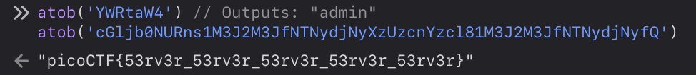

Problem: Login
Author: BROWNIEINMOTION
link: https://play.picoctf.org/practice/challenge/200

### Solution

- The challenge is a standard login page, with a username and a password field.

#### **Attempt 1:**
- try entering "admin" as both username and password.

#### VERDICT: Incorrect

#### Attempt 2:
- open the browser's developer tools and inspect the page's source code.
- the html is a basic form element.
- using the debugger tool in firefox developer tools, see the javascript code.

- Here's the javascript code:
```javascript
(
  async() => {
    await new Promise((e => window.addEventListener('load', e))),
    document.querySelector('form').addEventListener(
      'submit',
      (
        e => {
          e.preventDefault();
          const r = {
            u: 'input[name=username]',
            p: 'input[name=password]'
          },
          t = {};
          for (const e in r) t[e] = btoa(document.querySelector(r[e]).value).replace(/=/g, '');
          return 'YWRtaW4' !== t.u ? alert('Incorrect Username') : 'cGljb0NURns1M3J2M3JfNTNydjNyXzUzcnYzcl81M3J2M3JfNTNydjNyfQ' !== t.p ? alert('Incorrect Password') : void alert(`Correct Password! Your flag is ${ atob(t.p) }.`)
        }
      )
    )
  }
) ();

```

- Here I could notice some credentials auth using if conditions but the strings are encoded.
- looking up the javascript btoa() and atob() functions, the strings are being encoded to base64 and vice versa.
- I can decode the strings and get the correct username and password.



- convert the base64 encoded strings to ascii, the username turns out to be "admin".
- and the string "cGljb0NURns1M3J2M3JfNTNydjNyXzUzcnYzcl81M3J2M3JfNTNydjNyfQ" translates to "picoCTF{53rv3r_53rv3r_53rv3r_53rv3r_53rv3r}"


- ***Hence, we have our flag.***


